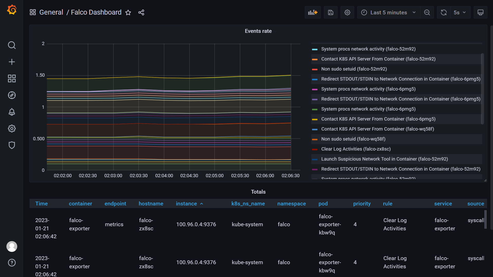
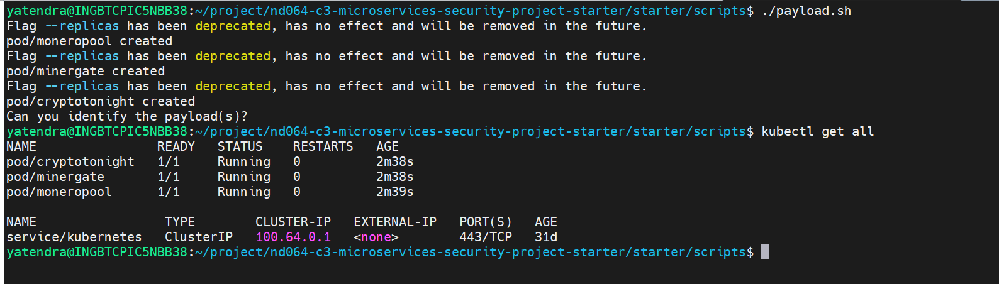
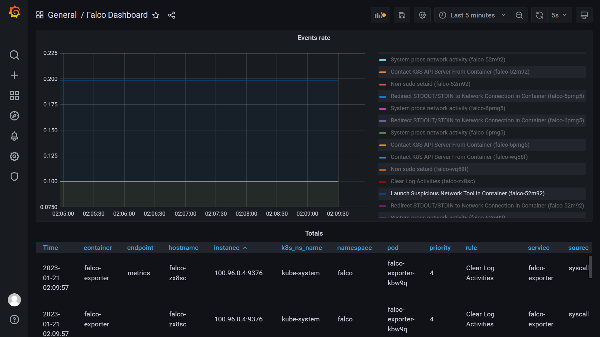

1. Incident commander name: Rashmi
2. Executive Summary of what happened: Grafana shows a huge spike of events, all appear to be about crypto-mining.
									   Event rate increase immediately.
									   
3. Summary of what was affected:Three pods running three different crypto miners were launched. They were increase the event rate very fastly.
								So CPU are busy to handle undesirable pods running. 
								
4. Summmry of the impact: The attacker managed to run crypto miners on our system, which is undesirable. Usually, crypto-mining consumes a lot of CPU.
						  We can see that in the last few minutes there is a significant spike in the CPU utilization for both Kubernetes and the default. 
						  This is related to the crypto miners being started.
						  CPU Utilization increase less then 1.5 to greater then 1.5
						  
5. Summary of the remediation steps: Delete the pods immediate by run this command:
									 kubectl --kubeconfig kube_config_cluster.yml delete pod <pod_name> --grace-period=0 --force>
									 when we delete the pods event rate become normal like as:
									 
									 
6. Summary of lessons learned: After learning all the lessons now I'm confident to make Docker image and kubernetes cluster hardened and to secure our cluster , docker images and application.
							   I also confident to use grype , syft and trivy for finding packages/dependencies vulnerabilities etc.
							   
