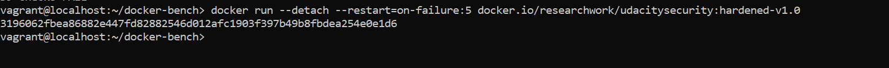

Docker Threat Modeling
Given Docker's system components and the STRIDE framework, identify five potential threats that may arise.
----------------------------------------------------------------------------------------------------------
There are multiple threts may arise like:
	1. Spoofing : It can be occure with docker components like malicious image or library as part of container image, sidecar conatainer access in Docker Host and Docker daemon intercepted by a malicious party.
	2. Tampering : It happen to get control of Docker client , affecting building image with Dockerfile and conatainer image can injected by malicious party.
	3. Repudiation : Malicious image may committed without authorization,changing of daemon by unlegitimate user and compromise with client.
	4. Information disclosure: hard coded configuration file may disclose the information , host can be exposed sensitive info and sensitive data may left in container image.
	5. Denial of Service : It occur because of docker distribution  may not properly restrict the amount of content accepted by user, Daemon memory for the running container may be over-allocate and excessive traffic from the client could overwhelm the daemon.
	6. Elevation of Privilege : In docker client when a Dockerfile does not specify a user it can happen , It can  privilege escalated if a user name is not defined and the container runs as root and Container image permissions may be elevated using the --privilege flag.
	
=> Docker has three main components of threats:
	1. Docker Client : It can be compromise, unlegitimate access and tempering with misconfiguration Dockerfile.
					   It can be Elevation of Privilege where we does not specify a user and it defaults to execute the container the root user which affecting client authorization and Dockerfile.

	2. Docker Host : There can be Isolation tempering , spoofing by sidecar conatainer intentional access and repudiation by change to the daemon that are not legitimate etc.
					 There may occur Denial of Service due to over-allocated memory of Daemon , it happen because of misconfiguration and tempering due to Daemon configuration tempared by compromised client etc.
					 
	3. Docker Registry : In case of Docker Registry , there can be wrong with Image security, Open Source Software (OSS) security and Docker registry security.
						 Elevation of privilege: Container image permissions may be elevated using the --privilege flag. Image libraries may contain security flaws. This can affect image security.
						 Repudiation : Malicious images may be committed without authorization by an attacker. This affects image security.
						 Denial of Service: Docker distribution may not properly restrict the amount of content accepted by a user. This allows remote attackers to cause a denial of service. This could affect registry security.
==============================================================================================================
Kubernetes Threat Modeling
Given Kubernetes' system components and the STRIDE framework, identify five potential threats that may arise.
Components of Kubernetes:
	1. Control Plane:
		kube-apiserver
		etcd
		kube-scheduler
		kube-controller-manager
		etcd
		cloud-controller-manager
	2. Data Plane 
		kubelet
		kube-proxy
Spoofing: API server could be spoofed by a malicious caller in control plane and connection between the API server and kubelet can be spoofed in Node runtime.
Tempering: configuration of etcd and kubelet may be tampered with by an attacker, it can be mitigate to restrict permissions 644 the pods spec. 
Repudiation: Unauthorized changes can be made to kubelet and API server , it can be mitigate by TLS. 
Information disclosure: Kube-proxy and etcd key-value store can expose sensitive information. it can be mitigate by set permissions 644.
Denial of Service: excessive traffic to the API server and kubelet can overwhelm the endpoint. To protect the kernel from runtime overruns, set the --protect kernel defaults to true.
Elevation of Privilege: privilege can be abused by using the privileged flag and In kubelet privileges should not be escalated, make sure the authorization mode argument is not set to always allow.
___________________________________________________________________________________________________________________
Docker-bench Run Results and Analysis
From the failed findings, select and document 3 findings from the Docker-bench results that you want to harden based on the 5 attack surface areas you identified in Step 1. At least 1 of the 3 hardened findings should be different from the ones mentioned in the exercise (i.e. 5.10, 5.14, and 5.22).
According to the Docker-bench evaluation with cis-1.2 :

There are multiple failed we got but we trying to fix some of them: 

	[FAIL] 5.10 Ensure that the memory usage for containers is limited (Scored)
	       for this we specify the memory size for container by this command:
			docker run --interactive --tty --memory 256m <image name> /bin/bash
			at build time:
				docker buld -t image-name --no-cache true --memory 256mb .
		According the hardened:

		
    [FAIL] 5.14 Ensure that the 'on-failure' container restart policy is set to '5' (Scored)
		   docker run -u --detach --restart=on-failure:5 researchwork/udacitysecurity:hardened-v1.0

	
	[FAIL] 5.22 Ensure that docker exec commands are not used with the privileged option (Scored)
		   To overcome this we should not use --privilege flag 

	Finally Docker hardened image:
