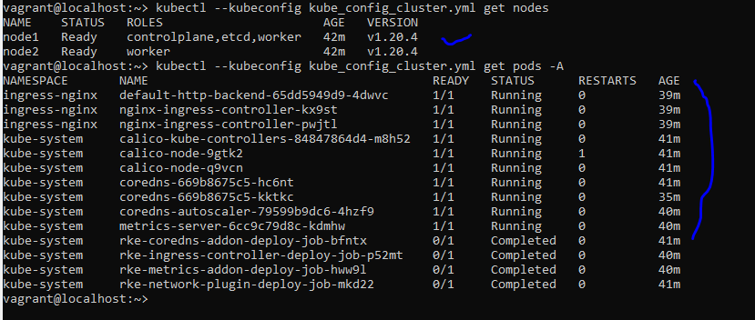
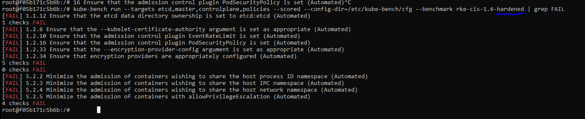
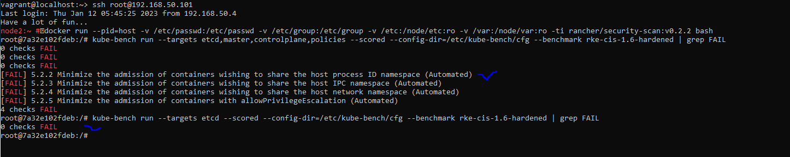

*KUBE_HARDENENING_TEST_PLAN*
Here we are trying to hardened kubernetes cluster via Kube-bench run, and define a methodology for how to harden Kubernetes with the CIS(Center of Internet Security) Benchmark in the real world.

Step 1. Closely review Kube-bench findings and threat model any implications based on Rancher Benchmark: 
	    Use the Rancher Benchmark Assessment PDF and think back to your threat model to reason through the finding. 
	    Pay special attention to how the risk can be realized versus just trying to address findings.
Ques 1. How will you test the changes?
	    Create a plan on how to test the change. Really think through the implications of the change. 
	    Often this needs to be closely coordinated with other teams and tested in a non-production environment.
	
Ques 2.	How will you ensure the changes don't negatively affect your cluster?
        To ensure the negative effect we'll Create a non-production cluster representative of your production. because
	    Sometimes problems due to hardening steps do not materialize unless there is a load on the system or traffic. 
	    One technique is canary testing, where we split some production traffic to the staging environment and test there. 
	    While testing in the non-production or staging cluster, we closely monitor metrics for regressions, i.e. undesired changes or consequences from hardening.
	
		Finally we Deploy the change to the production cluster, again closely monitoring for regressions to ensure the stability of the cluster.

##RKE setup and cluster nodes:
 

##Run kube-bench first time:
1. Execute the Docker container on node:
	docker run --pid=host -v /etc/passwd:/etc/passwd -v /etc/group:/etc/group -v /etc:/node/etc:ro -v /var:/node/var:ro -ti rancher/security-scan:v0.2.2 bash
then run kube-bench command:
	kube-bench run --targets etcd,master,controlplane,policies --scored --config-dir=/etc/kube-bench/cfg --benchmark rke-cis-1.6-hardened | grep FAIL

2. After the hardened via baseline hardening:

